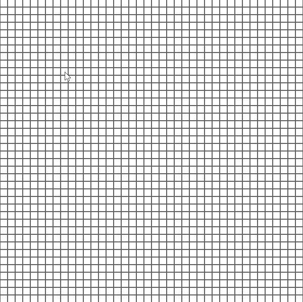
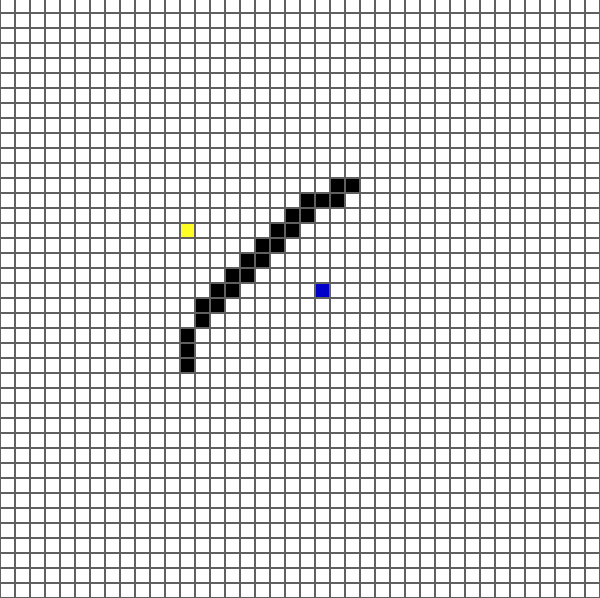

# A* Pathfinding visualization tool
### This is a simple pathfinding visualization tool done with python and pygame.

## Usage:
### Clone this repository and install the requirements, then run main.py. you can add the start and the end with the mouse wheel, create obstacles with the mouse left button and erase with the mouse right button. Once you added the start and the end you can press "space" or "s" to start the algorithm; after it's done you can press "c" to clear the algorithm and edit your course or "r" to reset the entire grid.

## Demos:

 

